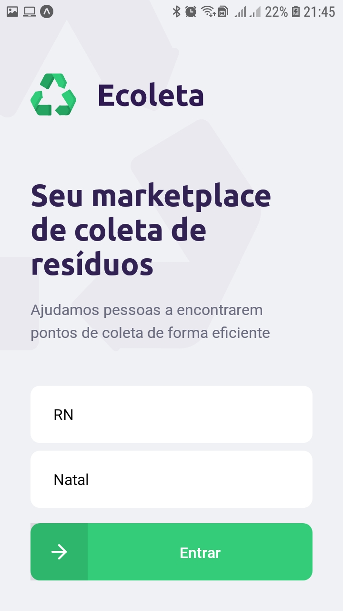
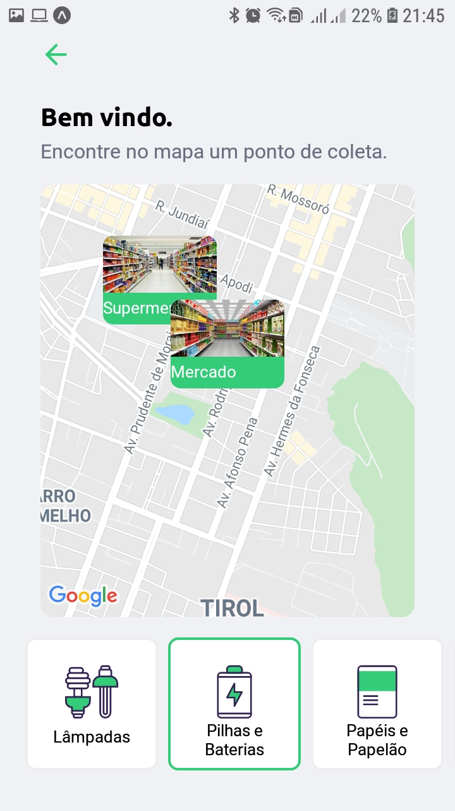
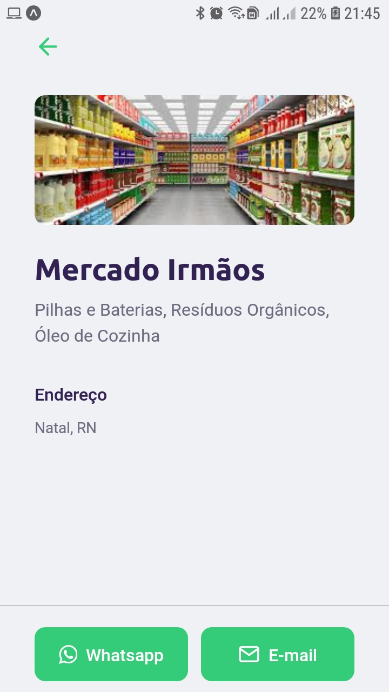

  
 

# Ecoleta

Projeto Construído durante o evento Next Level Week #01 da Rocketseat. Evento ministrado por Diego Fernandes.

## Sobre o App:
Aplicativo para ajudar o usuário no cadastro e na busca de estabelecimentos de coletas de resíduos.  

O aplicativo web permite o cadastro dos estabelecimentos, incluindo nome, email, whatsapp, localização, foto e itens coletados.  

O aplicativo mobile permite a consulta destes locais.

## Tecnologias utilizadas:

* TypeScript
* Node.js
* ReactJS
* React Native

## Pré-requisitos
* Node.js
* Gerenciador de pacotes NPM
* Expo

## Como rodar
* Fazer um clone deste repositório
* rodar o comando 'npm install' para instalar as dependências
* Entrar na pasta server pra criar o banco de dados: 'npm run knex:migrate'
* Entrar na pasta server pra popular o banco de dados: 'npm run knex:seed'
* Iniciar o backend com o comando: 'npm run dev'
* Iniciar a aplicação web com o comando: 'npm start'
* Iniciar o aplicação mobile com o comando: 'npm start'

## Aplicação web

## Aplicação Mobile

  

